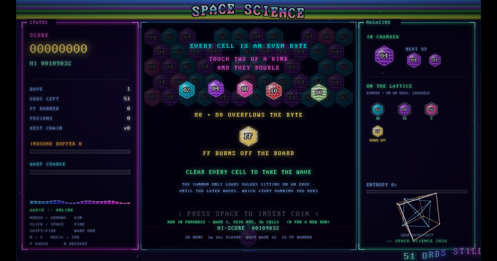

# SPACE SCIENCE

**by Balsa** — [spacescience.tech](https://spacescience.tech) — GPL-2.0

A hexadecimal bubble-fusion game dressed as an early-90s cracktro. Frozen Bubble
physics on a hex lattice, 2048's merge math in base 16, and a byte that overflows.

`dist/index.html` bundles its own font and soundtrack, so you can double-click
it and play. It makes exactly one network call, for analytics — see below.



## Rules

Every cell is an **even** byte, and it wears its hex value: `02 04 08 10 20 40 80`.

- **Touching cells collapse pairwise, the way 2048 does.** Every two of a kind
  become one of the next tier: `02`+`02` → `04`, `04`+`04` → `08`. A group of four
  `02`s gives **two** `04`s. Nothing is ever left stranded — an odd cell out is
  absorbed into a pair rather than sitting there unmerged, so three `04`s make a
  single `08`. That does destroy the odd cell's value; the alternative was a
  leftover cell that reads as "it only merged one side".
- **Where the survivors land is chosen, not arbitrary.** A fusion must never saw
  off the branch it stands on, so placement is scored by how many cells stay
  hung off the ceiling, and the cell you aimed at receives the fusion whenever
  it survives.
- **The powers of two are not the only ladder.** Doubling an even byte keeps it
  even, so `0A` climbs its own chain — `0A 14 28 50 A0` — and also dead-ends at
  `FF`. Cells only merge on an *exact* match, so an `0A` can never pair with an
  `08`. Colour tells you which chain a cell belongs to; the hex digits are the
  final word.
- **`80` + `80` overflows the byte.** The result does not fit in eight bits, so it
  saturates to `FF` — every bit set — and burns off the board. `FF` is the only
  exit a cell has, and it is never left sitting on the lattice. It does not go
  quietly either: **everything touching an `FF` detonates with it**, one tile
  out, which is what makes the long climb to `80` worth the trouble.
- **Clear every cell to take the wave.** Then a bigger, faster wave loads.
- **The cannon only loads values sitting on an exposed edge.** Bury the last `02`
  behind a wall of `20`s and the game stops handing you `02`. Watch what you seal in.
- **Knock a cluster loose from the ceiling** and the whole thing drops for points.
  A `DROP xN` also adds `2N` shots to the inbound-buffer countdown (`DROP x3`
  buys six), so a well-timed collapse can postpone a row that was about to flush.
  The countdown can bank at most 32 shots.
- **The inbound buffer flushes** every few shots, pushing a new row down. Let the
  stack cross the red line and you are done.
- **Later waves get stranger.** An entropy curve ramps from wave 1 (a tidy board,
  and the cannon always hands you something you can reach) to wave 10 and beyond:
  exotic layouts — bands, veins, scatter, checker — lone high bytes seeded with no
  partner anywhere, extra chains that cannot merge with each other, and **duds**:
  ammo matching nothing on any edge. A dud is not wasted, since two duds of a kind
  still pair, but stack them carelessly and you choke the lattice with values you
  cannot use. Watch the `ENTROPY` meter and the `DUD` warning on the chamber.
- **Warp orb**: fusions charge a meter. When it is full, `SHIFT`+fire launches a
  wildcard that becomes whatever it lands against. If that wildcard causes an
  `FF` overflow, it becomes a **SUPER FF**: the shortest occupied support path
  from the blast to the ceiling drops too, followed by anything that path was
  holding up. Every one of those drops extends the inbound buffer as usual.

The scroller along the bottom is a commentator, not a fixed greetz blob — it
reacts to your last few moves and to the state of the board. It only runs when
it has something new to say: board conditions are edge-triggered, so a line
fires when something *becomes* true and the strip goes quiet in between rather
than looping filler at you.

### Reading the cells

Only exact matches merge, so telling two cells apart is the whole game. Each one
carries the same fact on four redundant channels:

| channel | encodes | survives |
|---|---|---|
| hex digits | the exact value | everything |
| hue | the **rung** — how far up a ladder | normal vision |
| luminance | the rung, again | every kind of colour blindness |
| texture | the rung, again | total colour loss |
| hue rotation, saturation, luminance band | which **chain** | normal vision, mostly |

The loud channels go to the rung, not the chain, and that ordering matters. The
powers of two are a single chain and most of what is ever on the board, so
colouring by chain painted almost everything one blue and left `02` and `04`
near-identical — the one distinction the game is actually played on. Rungs now
span the whole wheel (`02` cyan, `04` violet, `08` magenta, …), each with its
own weave: plain, horizontal rules, diagonals, dots, cross-hatch, verticals,
chevrons. Chains are then pulled apart by a hue rotation, a saturation shift and
their own luminance band.

Hue alone would not do regardless: red-green colour blindness affects roughly
one man in twelve. The result was checked by simulating deuteranopia and
protanopia (Machado 2009) and by desaturating to pure greyscale. The first
attempt failed that check — the weaves were too faint to read once colour was
gone — so they were made heavier and retested.

## Controls

| | |
|---|---|
| Mouse / `←` `→` | aim |
| Click / `Space` | insert coin, then fire |
| `Shift` + fire | warp orb (when charged) |
| `P` / `Esc` | pause |
| `H` | open the paged field manual (`←` / `→` to turn pages) |
| `R` | restart |
| `M` / `S` | toggle music / SFX |
| `L` | trace every fusion chain to the console |

Touch works too: drag to aim, lift to fire.

The dotted guide follows the shot's physical route, including wall bounces; its
ghost hex is snapped to the exact lattice cell where the shot will first land.

The title screen takes a coin before it launches. That is not only theming —
browsers let audio start on a real gesture, and if that same keypress also
started the run, the intro track would be cut off the instant it began.

There is one more key. It is not in the table on purpose. There is also a cheat
code, the one your thumbs already know, and it makes the game genuinely unfair.

### Seeds

`dist/index.html#seed-1238123` replays an exact run — same layouts, same ammo,
same incoming rows. Any word works too (`#seed-hello`); it gets hashed. The seed
in play is printed in the bottom-right of the magazine panel and to the console,
so a board worth reporting can be handed over exactly as it happened.

Only game decisions draw from the seeded stream. Particles and starfield stay on
`Math.random()` on purpose: if effects consumed draws, the number of sparks alive
would shift the sequence and the same seed would stop reproducing the same board.

## Running it

Open `dist/index.html` in a browser. Nothing else is required.

For development the sources are ES modules, which browsers refuse to load over
`file://`, so serve them:

```sh
npm run dev        # http://localhost:8080/src/index.html
```

Then bundle back down to the single file:

```sh
npm run build      # src/ + fonts/ + music/ -> dist/index.html
```

## Tests

```sh
npm test
```

Drives the built page in headless Chrome over CDP, plays several hundred shots at
random angles, and asserts the rules actually hold: `FF` never comes to rest, only
legal byte values appear, the chambered value is always present on an exposed edge,
no cell escapes its row width, a group of four `02`s collapses to exactly two `04`s,
and an engineered `80`+`80` really does overflow, clear the board, and advance the
wave.

Several checks exist specifically to stop the suite passing by accident: the edge
rule is verified non-vacuous (cells really do get enclosed during play), the
deep-wave probe re-enters wave 12 whenever it dies so it cannot quietly measure
entropy 0, and seeds are checked to both reproduce *and* differ.

Needs a `google-chrome`/`chromium` binary on `PATH`. `npm run shots` regenerates
the screenshots in this README.

### Profiling

```sh
node tools/ffdrive.mjs 10          # 10s in a real Firefox window, over WebDriver BiDi
node tools/ffdrive.mjs --eval '…'  # run an expression in the page
```

Load either page with `#profile` for a live FPS/section overlay, or `#bench` to
render a fixed number of frames and paint a report that stays on screen.

Two things make this less obvious than it sounds, both learned the hard way:

- **Headless Firefox is useless for frame timing.** It throttles
  `requestAnimationFrame` to roughly one frame per second, so you measure the
  headless policy rather than the code. `#bench` therefore drives itself with
  `setTimeout`, and `ffdrive.mjs` drives a real visible window instead.
- **The JS-side number is not the whole cost.** Firefox rasterises the canvas off
  the main thread, so an expensive paint never shows up in a `performance.now()`
  delta. This game once ran at 1 fps while reporting 4.5 ms frames, which is why
  `ffdrive` reports wall-clock FPS — frames actually delivered.

The culprit that time was `shadowBlur`: ~18× the cost of plain text in Firefox,
paid per glyph. Every glow string, panel border and the hex lattice is now
rasterised once into a sprite and blitted. That took the frame from 803 ms to
17 ms, and the real window from ~0.5 fps to a vsync-locked 58.

## Layout

```
src/
  config.js      constants, the byte ladder, wave curve, scoring
  util.js        math helpers, tier -> hue, hex labels
  canvas.js      the 1280x720 offscreen buffer and letterbox fit
  audio.js       playlist, SFX synth, analyser tap
  music.js       soundtrack manifest (build inlines the oggs here)
  sprites.js     per-value hexagon sprites, rendered once and cached
  fx.js          particles, shockwaves, score pops, shake/glitch/flash
  backdrop.js    starfield, sine plasma, copper bars, wireframe vectors
  text.js        cached glow text, chrome logo, the scroller
  commentary.js  generates what the scroller says about your play
  rng.js         seeded RNG for board decisions (visuals stay unseeded)
  analytics.js   Cloudflare virtual-pageview reporting
  stats.js       career stats and the local scoreboard
  save.js        versioned resume-in-progress storage
  game.js        the rules: grid, physics, fusion, edges, waves, entropy
  render.js      playfield, launcher, HUD panels, overlays, compositor
  input.js       mouse / touch / keyboard
  profile.js     section timer and benchmark report
  main.js        fixed-timestep loop and boot
build.mjs        flattens src/ and inlines font + music into dist/index.html
tools/
  serve.mjs      static dev server
  smoke.mjs      headless rules + regression test (Chrome/CDP)
  ffdrive.mjs    real-window profiler and page driver (Firefox/BiDi)
```

### About the build

`build.mjs` is deliberately tiny. It topologically sorts the modules, strips
`import`/`export`, and concatenates everything into one scope inside an IIFE.
That only works because the source obeys a few rules, and the build enforces all
of them rather than emitting something subtly broken:

- imports must be relative and named — default and namespace imports are rejected
- `import { a as b }` becomes a real `const b = a`, because otherwise `b` simply
  would not exist once the scope is flattened
- no two modules may declare the same top-level name
- no import cycles
- nothing that still looks like module syntax may survive stripping — Node's ESM
  auto-detection will happily parse a leftover `import`, but a classic `<script>`
  will not

It also base64-inlines `fonts/*.woff` into the `@font-face` rule and `music/*.ogg`
into the soundtrack manifest. The music is essentially all of the ~10 MB weight of
`dist/index.html`; that is the deliberate trade for "one file you can double-click".

### Debug hook

Load with `#debug`, `#profile` or `#bench` and `window.SPACESCIENCE` exposes
`{ G, step, nextWave, newGame, setSeed, Snd, PROF, summary, LOG }` — live state
plus a way to advance the simulation by hand. `#debug` also switches on the chain
tracer, which prints what every collapse consumed and produced:

```
[SS] shot 04 -> landed (1,3)
[SS]   collapse#1  04 x2 (1,3)(0,3)  pairs=1 odd=0  ->  08 x1 at (1,3)  +64
[SS] settled after 1 collapse(s); 7 orbs, top byte 08, score 2196
``` That is the seam the smoke test drives, since a headless
browser produces frames far too slowly to play through a game in real time.

## Analytics and stats

The page loads the Cloudflare Web Analytics beacon. That is the only network
call it makes, and the only reason the file is not fully self-contained; if the
script is blocked or unreachable, nothing breaks.

**Cloudflare Web Analytics cannot store a score.** Their FAQ is explicit — "Not
yet, but we may add support for this in the future" — there is no custom-event
or custom-dimension API, and query strings are deliberately not logged. So the
interesting numbers had to be split in two.

### What goes to Cloudflare

The beacon's one usable hook is SPA tracking: it overrides `history.pushState`
and logs a pageview for whatever path is pushed. Findings are therefore encoded
as short virtual **paths**, then the real URL is restored with `replaceState`
(which the beacon does not hook) so a refresh still works and the `#seed`
survives:

| path | meaning |
|---|---|
| `/_ss/load` | the page booted |
| `/_ss/run/start` | a run began |
| `/_ss/wave-clear/7` | a wave was cleared (`15plus` above 15) |
| `/_ss/over/wave-7` | a run ended, and how deep it got |
| `/_ss/score/20k-50k` | final score, bucketed |
| `/_ss/played/10m` | cumulative playtime milestone |
| `/_ss/hyper` | the cheat code was used |

Everything is bucketed on purpose — exact scores would produce thousands of
one-hit rows and make the dashboard useless.

Three caveats worth knowing before reading the numbers:

- **It does nothing from `file://`.** There is no origin to beacon from and
  `pushState` throws, so reporting disables itself. Analytics only exist when
  the game is actually hosted.
- `static.cloudflareinsights.com` is a common ad-block target, so every figure
  is a floor, not a count.
- `navigator.doNotTrack` is respected; reporting switches off entirely.

### Resuming a run

The board is written to `localStorage` every time it settles, so closing the tab
mid-run costs at most the shot that was in flight. The title screen then offers
`PRESS SPACE TO RESUME` with the wave, score and cell count; `R` throws the run
away and starts fresh. Reaching game over clears it — a finished run is not
worth resuming into.

The RNG position is saved alongside the board. Without it a resumed wave would
re-roll its ammo from the top of the stream and a `#seed` run would stop being
reproducible.

Saves carry a version stamp. Anything unreadable — a corrupt entry, or a board
written under older rules — is discarded rather than half-applied, and the
geometry is re-validated on load (row widths against the current parity, every
value an even byte) before a single cell is restored.

### What stays on the machine

The scoreboard Cloudflare cannot hold lives in `localStorage`, which also keeps
working offline and with the beacon blocked: top five runs with wave and FF
count, total runs, total time played, best wave, best chain, waves cleared and
cells fused. The top five show on the game-over card, the totals on the title
screen. Nothing identifying is stored or sent.

## Credits and licences

**SPACE SCIENCE is by Balsa**, released under the **GNU General Public License,
version 2** — see [`LICENSE`](LICENSE). GPL-2.0 is not an arbitrary pick: the
soundtrack is Frozen Bubble's, which is GPL-2.0, so it is the licence this
project has to carry anyway.

Two third-party assets are bundled:

**Soundtrack** — `introzik.ogg`, `frozen-mainzik-1p.ogg` and
`frozen-mainzik-2p.ogg` come from **Frozen Bubble**, the GPL-2.0 puzzle game by
Guillaume Cottenceau and contributors — the same game this one owes its
bounce-and-stick physics to. The tracks are used under the GPL-2.0; if you
redistribute this, those terms come with them.

**Font** — *Web437 IBM VGA 8x16* from
[The Ultimate Oldschool PC Font Pack](https://int10h.org/oldschool-pc-fonts/)
v2.2, copyright © 2016–2020 VileR, licensed **CC BY-SA 4.0**. The full licence
text is in `fonts/LICENSE-oldschool-pc-font-pack.txt`. It is bundled as an
aggregate work and keeps its own licence; it is not relicensed under the GPL.

## Deploying

See [`DEPLOYMENT.md`](DEPLOYMENT.md). Short version: `npm run deploy` with
`SS_HOST` set copies two files to an nginx origin — no rebuild, no restart, no
downtime.
